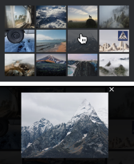
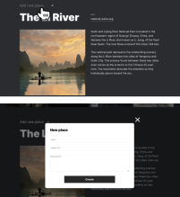

# Project "Traveling"

## Review
* Link to GitHub repository
* Link to published website
* Description
* Features

---

### Link GitHub Pages:
* https://github.com/TikhonovaKs/traveling.git

### Link to published website:
* https://frabjous-babka-5efbae.netlify.app/

---

### Description
***Traveling*** is a web application designed for travel enthusiasts. It offers two usage modes: as a guest and as a profile owner.

* Guest Mode:
In guest mode, you have access to the entire page content. You can browse various places and also enlarge images in the gallery by clicking on them. However, the "Add New Place" button will not be visible to you.

* Profile Owner Mode:
If you are the owner of a profile, you need to log in to your account using your email address and password. In this mode, you can add new places by clicking on the "Add New Place" button and filling out the corresponding form.

---

### Features:
* Project is adapted for various screen resolutions (from 1280px to 320px).
* Class naming follows the BEM methodology.
* Responsive layout that displays correctly on all intermediate resolutions.
* Semantic markup is used to improve accessibility.
* Layout framework is implemented using Flex layout or Grid layout.
* Images have the 'alt' attribute set with a suitable value to enhance accessibility.